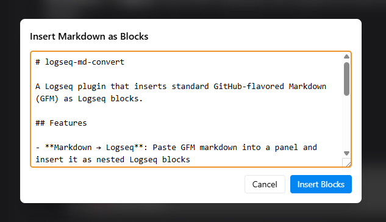

# logseq-md-convert

A Logseq plugin that inserts standard GitHub-flavored Markdown (GFM) as Logseq blocks.

## Features

- **Markdown → Logseq**: Paste GFM markdown into a panel and insert it as nested Logseq blocks

## Screenshot


## Installation

### From the Marketplace
Search for **MD Convert** in the Logseq plugin marketplace.

### Load Unpacked (Development)
1. Clone this repo and run:
   ```bash
   npm install
   npm run build
   ```
2. In Logseq: **Settings → Plugins → Load unpacked plugin**
3. Select the `dist/` folder

## Usage

One button appears in the Logseq toolbar:

| Button | Direction | What it does |
|--------|-----------|--------------|
| **MD** | Markdown → Logseq | Opens a panel; paste GFM markdown and click **Insert Blocks** to add it as children of the focused block |

The action is also available as a slash command:
- `/Insert Markdown as blocks`

## Conversion Reference

| Markdown | Logseq block |
|----------|--------------|
| `- [ ] task` | `TODO task` |
| `- [x] task` | `DONE task` |
| `1. item` | `- item` (converted to bullet) |
| Nested list items | Child blocks |
| `# Heading` | Block with heading content |
| YAML frontmatter | `key:: value` properties block |
| Fenced code blocks | Single block with full fence preserved |

**Example:**

Input markdown:
```markdown
---
tags: project
---
# Project Notes
- [ ] Write tests
- [x] Set up repo
```

Inserted blocks:
```
tags:: project
# Project Notes
TODO Write tests
DONE Set up repo
```

## Development

```bash
pnpm run dev    # start dev server with HMR
pnpm run build  # production build to dist/
```

## License

MIT
